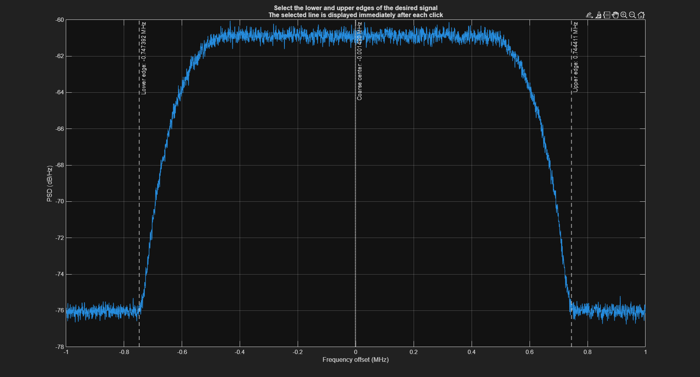
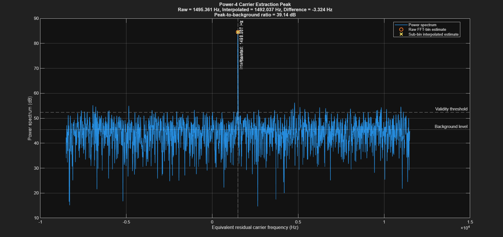
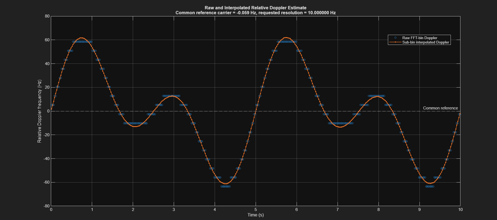
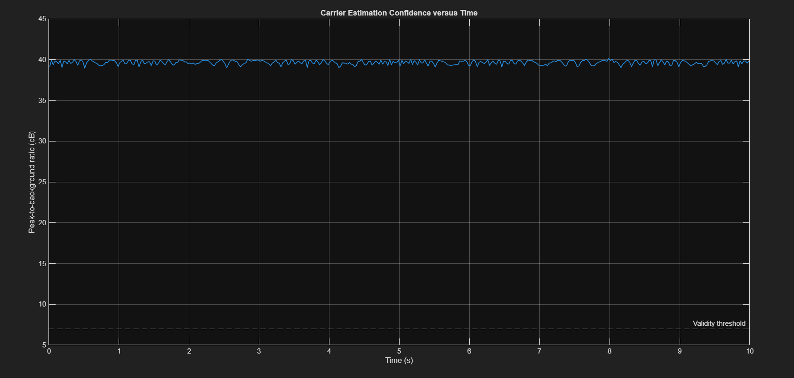

# PSK CFO & Doppler Monitor

MATLAB tool for carrier frequency offset (CFO) estimation and temporal frequency monitoring of PSK IQ recordings using M-th power carrier extraction, FFT peak detection, and sub-bin parabolic interpolation.

## Overview

This project provides an interactive workflow for estimating and monitoring carrier frequency from recorded complex IQ signals.

The processing chain combines PSD-based signal-band selection, baseband downconversion, FIR channel filtering, resampling, and M-th power spectral analysis.

The implementation provides raw FFT-bin and interpolated frequency estimates, together with a peak-to-background confidence metric.

Supported modulation selections include:

- BPSK
- QPSK
- OQPSK
- 8PSK

The user can specify a target frequency resolution that determines the observation duration used for each estimate.

> **Interpretation:** Measured frequency offsets and their temporal changes can include Doppler, transmitter/receiver oscillator offsets, and oscillator drift. The estimator does not independently separate these contributions.

## Key Features

- Interactive IQ file selection
- Support for signed 16-bit integer and 32-bit floating-point IQ samples
- Welch power spectral density estimation
- Interactive signal-band selection
- Coarse carrier-frequency estimation
- Baseband downconversion
- FIR channel filtering
- Guarded resampling
- DC removal and RMS normalization
- M-th power carrier extraction
- Windowed FFT analysis
- Three-point parabolic peak interpolation
- M-th power frequency-ambiguity handling
- Frame-by-frame carrier-frequency monitoring
- Peak-to-background confidence measurement
- Comparison of raw FFT-bin and interpolated estimates
- Diagnostic plots and command-window summaries
- Controlled QPSK validation example generated with GNU Radio

## Processing Pipeline

1. Read the complex IQ recording.
2. Estimate the power spectral density.
3. Select the signal band.
4. Estimate the coarse carrier frequency.
5. Translate the selected signal to baseband.
6. Apply FIR channel filtering.
7. Resample the filtered signal.
8. Remove DC and normalize the signal.
9. Apply the M-th power operation.
10. Apply a window and compute the FFT.
11. Detect the spectral peak.
12. Refine the peak using sub-bin parabolic interpolation.
13. Resolve the frequency branch using the available coarse estimate.
14. Evaluate estimation confidence.
15. Generate carrier-frequency and relative-frequency results over time.

## Supported Modulations

The modulation selection determines the exponent `M` used for carrier extraction.

| Modulation | M |
|---|---:|
| BPSK | 2 |
| QPSK | 4 |
| OQPSK | 4 |
| 8PSK | 8 |

For ideal M-PSK symbols, raising the signal to the M-th power removes the discrete symbol-phase contribution and multiplies the carrier-frequency offset by `M`.

Performance on sampled waveforms depends on pulse shaping, signal quality, and preprocessing. In particular, OQPSK staggering and waveform transitions can affect the strength and structure of the extracted spectral component.

The modulation type is selected by the user; the program does not automatically classify modulation.

## Frequency Resolution

The requested frequency resolution controls the observation duration used for each estimate.

The nominal carrier-frequency spacing associated with an unpadded frame-length FFT is:

```text
Δf = Fs,resampled / (M × Nframe)
```

where:

- `Fs,resampled` is the sampling rate after resampling.
- `M` is the selected modulation exponent.
- `Nframe` is the number of resampled samples in the observation frame.

Equivalently:

```text
Tframe = Nframe / Fs,resampled

Δf = 1 / (M × Tframe)
```

A finer nominal frequency spacing therefore requires a longer observation interval.

Longer frames also reduce temporal localization. If the carrier frequency changes substantially within a frame, the spectral peak may broaden and the estimate may become less reliable.

> The requested resolution is a nominal analysis setting, not a guarantee of estimation accuracy. Zero-padding and interpolation refine the frequency grid but do not increase the physical observation duration.

## Carrier Estimation

After preprocessing, the normalized complex signal is raised to the selected exponent:

```text
y[n] = x[n]^M
```

A Hann window is applied, followed by FFT-based spectral analysis.

The detected spectral peak gives the initial frequency estimate in the M-th power domain. Its frequency is mapped back to the carrier domain by division by `M`, with the corresponding frequency-branch correction.

The program produces two estimates:

- **Raw estimate:** Based on the detected FFT-bin location.
- **Interpolated estimate:** Refined using a three-point parabolic fit around the detected peak.

Interpolation reduces FFT-grid quantization effects, but its performance depends on the local peak shape and signal quality.

## Estimation Confidence

The program evaluates each frame using a peak-to-background ratio.

The background level is estimated from the median spectral power outside a guard region around the detected peak.

The default acceptance threshold is:

```text
7 dB
```

Estimates below the configured threshold are rejected.

This metric indicates spectral-peak prominence. It is not a calibrated probability of correctness or a statistical confidence interval.

## Input Data

The input is a binary recording containing interleaved in-phase and quadrature samples:

```text
I0, Q0, I1, Q1, I2, Q2, ...
```

Supported sample formats:

| Format | Description |
|---|---|
| `int16` | Signed 16-bit integer samples |
| `float32` | 32-bit floating-point samples |

The user supplies:

- IQ recording file
- Sample format
- Sampling frequency
- Receiver center frequency
- Modulation selection
- Requested frequency resolution

The lower and upper signal-band edges are selected interactively from the displayed PSD.

Recordings must match the sample ordering and binary format expected by the implementation. Files containing headers or other layouts require appropriate conversion before use.

## Requirements

### MATLAB Estimator

- MATLAB
- Signal Processing Toolbox
- A MATLAB environment supporting interactive dialogs and figures

Functions used by the implementation include:

- `pwelch`
- `fir1`
- `resample`
- `hann`
- `hamming`
- `fft`

A minimum supported MATLAB release has not yet been formally established.

### GNU Radio Validation Example

GNU Radio is required only when opening or reproducing the included validation flowgraph.

The flowgraph was created using:

```text
GNU Radio 3.10.12
```

## Getting Started

### 1. Obtain the Repository

Clone the repository using its GitHub clone URL, or download and extract the ZIP archive.

Access to this private repository is required.

### 2. Open MATLAB

Set the MATLAB Current Folder to the repository root.

### 3. Add the Source Directory and Run

```matlab
addpath('src');
doppler_estimator_parametric_resolution;
```

Alternatively, open the following file in the MATLAB Editor and select **Run**:

```text
src/doppler_estimator_parametric_resolution.m
```

### 4. Complete the Interactive Workflow

1. Select an IQ recording.
2. Choose the sample format.
3. Enter the requested signal and processing parameters.
4. Inspect the displayed PSD.
5. Select the lower and upper edges of the signal band.
6. Allow the program to process the recording.
7. Inspect the diagnostic plots and frequency-monitoring results.

## Main Parameters

| Parameter | Purpose |
|---|---|
| Sample format | Determines how binary IQ samples are read |
| Sampling frequency | Defines the input time and frequency scales |
| Receiver center frequency | Provides the reference for reported RF-frequency values |
| Modulation selection | Determines the M-th power exponent |
| Selected signal band | Defines the channel to isolate and analyze |
| Requested frequency resolution | Controls the observation duration |
| Confidence threshold | Controls acceptance of detected spectral peaks |

Some settings are entered interactively, while others are configured in the source file.

## Main Outputs

The implementation generates diagnostic and estimation plots, including:

- Selected signal band on the PSD
- Spectrum after filtering and resampling
- Raw and interpolated spectral-peak estimates
- Carrier frequency versus time
- Relative frequency variation versus time
- Interpolation correction
- Carrier-estimation confidence

A numerical summary is also printed in the MATLAB command window.

The technical report provides examples and explanations of the output figures.

## Synthetic Signal Example

The estimator was tested using a QPSK IQ recording with a controlled time-varying frequency offset generated in GNU Radio.

The GNU Radio flowgraph and its configuration details are available in the [GNU Radio example directory](examples/gnuradio/).

The flowgraph reads an external interleaved signed 16-bit QPSK recording, applies a controlled frequency variation using a voltage-controlled oscillator, and writes the resulting IQ samples to an output file.

The test recording has the following characteristics:

| Parameter | Value |
|---|---|
| Modulation | QPSK |
| Sampling rate | 2 MHz |
| Sample format | Interleaved signed 16-bit I/Q |
| Recording duration | 10 seconds |
| Requested estimator resolution | 10 Hz |
| Confidence threshold | 7 dB |
| GNU Radio version | 3.10.12 |

The applied time-varying frequency offset is approximately:

```text
Δf(t) = 70 × cos(2π × 0.1t) × sin(2π × 0.3t) Hz
```

Equivalently:

```text
Δf(t) = 35 × [sin(2π × 0.4t) + sin(2π × 0.2t)] Hz
```

The waveform repeats every 5 seconds and reaches approximately ±61.6 Hz.

### Signal-Band Selection

The signal bandwidth is selected from the estimated power spectral density before carrier processing.



### Carrier-Extraction Peak

The M-th power spectrum produces a prominent carrier-related peak. Parabolic interpolation refines the estimate beyond the raw FFT-bin grid.



### Relative Frequency Tracking

The estimated relative-frequency curve follows the periodic frequency variation introduced by the GNU Radio flowgraph. The interpolated estimate reduces the quantized appearance of the raw FFT-bin estimate.



### Estimation Confidence

The peak-to-background ratio remains around 39–40 dB throughout the recording, substantially above the 7 dB validity threshold.



> The plotted relative-frequency variation represents the combined observable frequency offset. In a real measurement, this variation may include Doppler, oscillator offset, and oscillator drift.

## GNU Radio Example

The validation flowgraph is located at:

```text
examples/gnuradio/qpsk_doppler_example.grc
```

Detailed configuration and usage information is available in:

[GNU Radio Example Documentation](examples/gnuradio/README.md)

The flowgraph expects a local QPSK source recording named:

```text
qpsk_input_int16.dat
```

The default generated output filename is:

```text
qpsk_doppler_test_int16.dat
```

File paths can be changed from the File Source and File Sink blocks in GNU Radio Companion.

## Repository Structure

| Path | Contents |
|---|---|
| `README.md` | Project overview and usage instructions |
| `.gitignore` | Exclusion rules for temporary files and local recordings |
| `src/doppler_estimator_parametric_resolution.m` | Main MATLAB implementation |
| `docs/README.md` | Documentation overview |
| `docs/PSK_CFO_Doppler_Monitor_Report_FA.pdf` | Persian technical report |
| `assets/figures/` | Output figures from the synthetic-signal test |
| `assets/figures/README.md` | Description of the result figures |
| `examples/gnuradio/README.md` | GNU Radio test configuration and usage notes |
| `examples/gnuradio/qpsk_doppler_example.grc` | Flowgraph used to generate the controlled QPSK frequency variation |

## Technical Notes and Limitations

- **Frequency offset and Doppler:** Frequency variation alone does not establish its physical cause. Interpreting the result as Doppler requires suitable oscillator references and knowledge of the measurement setup.
- **Sampling-rate accuracy:** Errors in the supplied or actual sampling rate affect the frequency scale and reported estimates.
- **Receiver reference:** Absolute RF-frequency estimates depend on the accuracy of the receiver center-frequency reference.
- **Band selection:** The selected band should isolate the signal while retaining its relevant spectral content.
- **Frequency ambiguity:** The M-th power operation introduces multiple possible carrier-frequency branches. Correct branch selection depends on the available coarse-frequency information.
- **Within-frame variation:** Rapid frequency changes can smear the spectral peak during long observations.
- **Interference:** Strong neighboring signals or spurious spectral components can affect peak selection.
- **Waveform dependence:** Modulation format, pulse shaping, and OQPSK staggering can affect M-th power carrier extraction.
- **Confidence interpretation:** A prominent peak does not by itself prove that the correct carrier or ambiguity branch was selected.
- **Validation scope:** The included controlled test demonstrates tracking of one QPSK frequency-offset profile. Broader quantitative validation requires additional SNR levels, modulation formats, offset profiles, and repeated trials.
- **GNU Radio input dependency:** The included flowgraph requires a compatible local QPSK IQ recording as its input.

## Data Handling

Raw IQ recordings are not currently included in the main Git repository.

The `.gitignore` file contains exclusions for common recording formats and local data directories, including:

```gitignore
*.dat
*.iq
*.bin
*.raw

data/raw/
data/recordings/
```

These rules help prevent untracked local recordings from being added through Git. They do not remove files that are already tracked and should not be treated as a safeguard for uploads through the GitHub web interface.

Large IQ examples can be distributed separately through GitHub Releases without adding them to the main Git history.

## Documentation

A Persian technical report describes the processing stages, mathematical formulation, and interpretation of the results.

[Read the technical report](docs/PSK_CFO_Doppler_Monitor_Report_FA.pdf)

Additional documentation for the validation flowgraph is available here:

[Read the GNU Radio example documentation](examples/gnuradio/README.md)

## Project Status

The current implementation provides an interactive MATLAB workflow for PSK carrier-frequency estimation and temporal frequency monitoring from recorded IQ data.

A controlled QPSK test generated in GNU Radio has been used to verify that the estimator follows the applied time-varying frequency profile.

Potential future improvements include:

- Additional synthetic test scenarios with different SNR and frequency-offset profiles
- Automated performance evaluation
- Bias and RMSE analysis across SNR conditions
- Evaluation under controlled frequency drift
- Comparison with alternative carrier-frequency estimators
- Automated signal-band detection
- Export of numerical results
- Additional waveform-specific validation

These items describe possible development directions and are not claims about existing functionality.

## Author

**Mehdi Ghaderi**

Research interests:

- Signal Processing
- Digital Communications
- Remote Sensing
- Image Processing
